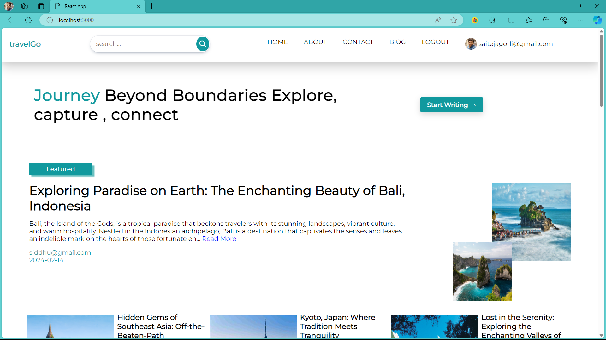
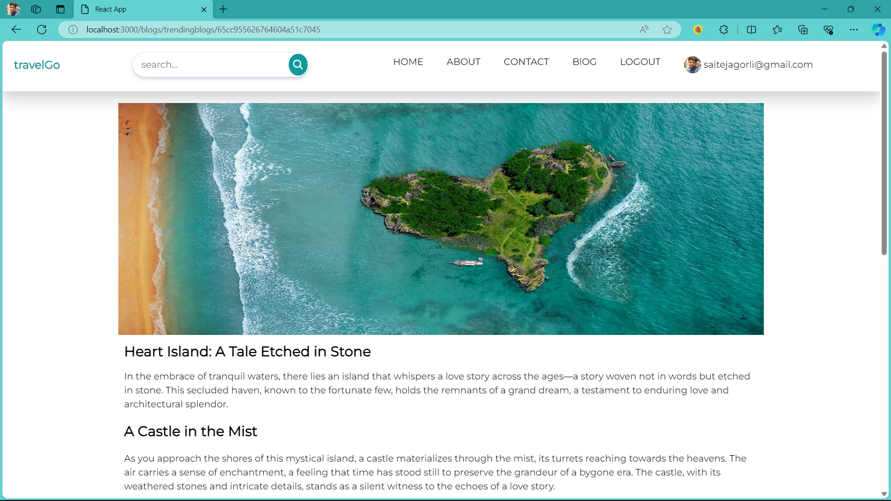
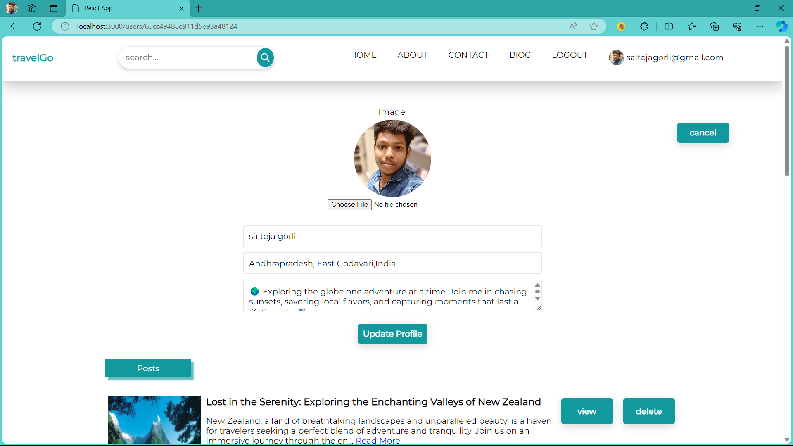

# ✈️travelGo Website

Welcome to 🌍travelGo, a travel blogging platform where users can share their exciting travel experiences, discover new destinations, and connect with fellow travel enthusiasts.

## Table of Contents
- [Features](#features)
- [Getting Started](#getting-started)
  - [Prerequisites](#prerequisites)
  - [Installation](#installation)
- [Usage](#usage)
- [Technologies Used](#technologies-used)

## Features

- **User Authentication:** Create an account, log in, and manage your profile.
- **Create and Share Posts:** Share your travel stories, tips, and photos with the community.
- **Discover Exciting Destinations:** Explore a diverse collection of travel posts from other users.
- **Responsive Design:** Enjoy a seamless experience on various devices.

# Getting Started

### Prerequisites

Before you begin, ensure you have the following installed:

- Node.js: [Download Node.js](https://nodejs.org/)

## Installation

1. Clone the repository:

   ```bash
   git clone https://github.com/Saitejagorli/travelGo.git
   cd travelGo
### Install backend dependencies
cd server
npm install

### Install frontend dependencies
cd client
npm install

### Set up environment variables:
Create a .env file in the server folder with the following content:

PORT = 8000

SECRET_KEY = your_key

USER_NAME = your_username

PASSWORD =  your_password

FRONTEND_URL = your_frontend_url

# Run the application:
### Start the server
cd server
npm start

### Start the frontend
cd client
npm start

The application should now be running at http://localhost:3000 (or another specified port).

# Usage

visit the website at https://your-travelgo2k24.netlify.app

access the backend at https://travelgo-backend-bvsk.onrender.com

Create an account, log in, and start sharing your travel experiences.

Explore posts from other users, and connect with fellow travelers.

# Technologies Used
Frontend: React

Backend: Node.js, Express

Authentication: JWT

Database: MongoDB

Deployment: Render, Netlify

# Images








